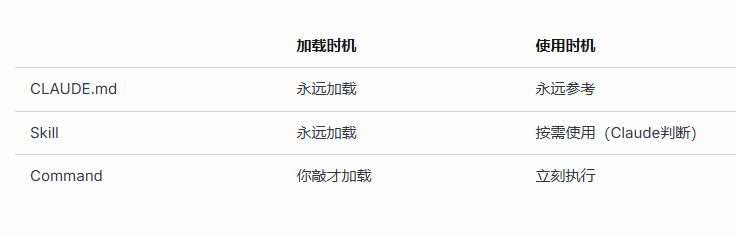

# 如何更好使用 Claude Code (英文)[readme.md]

## CLAUDE.md
**放什么：** 项目说明书，给Claude看的
```
- 项目是干嘛的
- 代码规范（命名、风格）
- 常用命令（如何build、test）
- 注意事项/禁忌  
```
**放哪：** 项目根目录

---

## .claude 文件夹
**放哪：** 项目根目录 或 `~/.claude`（全局）

**里面有：**
- `settings.json` - 配置
- `commands/` - 自定义命令
- `skills/` - 可复用技能

---

## commands
**作用：** 一个斜杠命令 = 一段预设prompt

```
/review  →  展开成 "检查这段代码的问题，给出修改建议"
```
省得每次打一堆字

---

## skills
**作用：** 可复用的知识/能力模板

比如写一个 `write-test.md`，描述"如何给这个项目写单元测试"，下次直接引用

---

## MCP Server

**本质区别：**
```
内置工具调用：Claude自带的（读文件、跑命令）
MCP：扩展插件，连接外部服务
```

**Playwright MCP 例子：**
```
Claude → MCP协议 → 本地Playwright服务 → 控制浏览器
```

就是把外部能力通过标准协议暴露给Claude调用。
